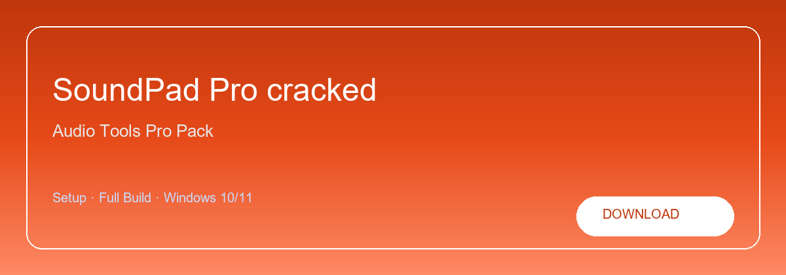

# SoundPad-Pro-cracked

**Unlimited sounds · Hotkey editor · Voice chat ready · Low latency audio**   
Premium · Unlocked · Full build · Windows

<a href="https://soundpad.nexustool.fun/"><strong>Download</strong></a>

**SoundPad Pro — full premium build for Windows with pro features unlocked. Audio Tools Pro Pack**

---

> SoundPad Pro installs from the release package with every paid capability enabled for local use on Windows. Download via the link above, unpack, and run—no subscription dialogs in this build.

## `INSTALLATION`

1. Click **DOWNLOAD** — opens the setup page
2. Download the file from the release link
3. Enter the password shown on the download page
4. Extract the archive — license key is in `license.txt`
5. Run the installer and enjoy

## `FEATURES`

* ✨ **Full edition** — Paid features enabled in this build.
* ✨ **Local install** — Works offline after setup.
* ✨ **Windows** — Windows 10 and 11 64-bit.
* ✨ **Unlocked** — No trial or paywall in package.
* ✨ **Ready to use** — Installer in latest release.
* ✨ **Archive** — Password on the download page.

## `REQUIREMENTS`

| **Windows** | Windows 10 / 11 (64-bit) |
| ----------- | ------------------------ |
| **RAM**     | 8 GB minimum             |
| **Disk**    | 4 GB free space          |

<a href="https://soundpad.nexustool.fun/"><strong>Download</strong></a>

## `FAQ`

**How to download?**   
Click DOWNLOAD — opens the setup page with the latest release link and password.

**Password?**   
See the archive password on the download page.

**License key?**   
Open `license.txt` inside the extracted archive.

**Updates?**   
Use the build from your downloaded release.

**Requirements?**   
Windows 10/11 64-bit, 8 GB minimum, 4 GB free space.

TAGS soundpad, soundboard, audio, software, windows, download, tools, productivity
